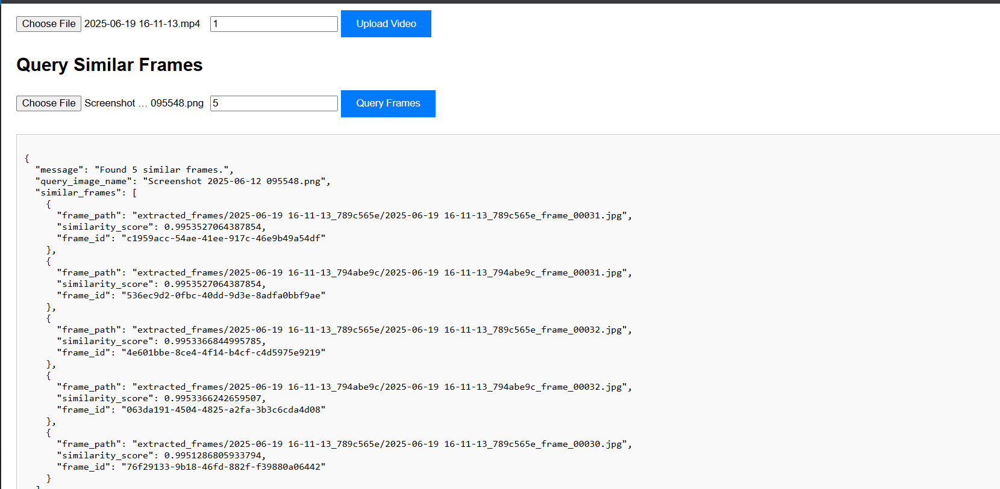
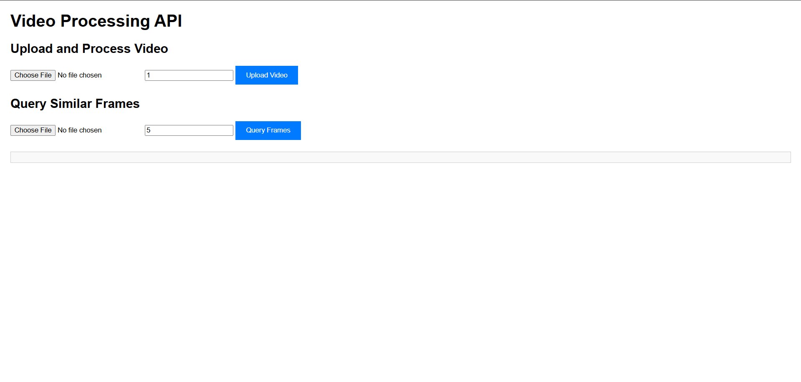

# FastAPI-VideoProcessing

A FastAPI backend for uploading videos, extracting frames, computing feature vectors, and querying for similar frames using an in-memory Qdrant vector database.


## Features
- Upload video files and extract frames at a specified interval
- Compute color histogram feature vectors for each frame
- Store and search frame vectors using Qdrant (in-memory)
- Query for similar frames by uploading an image
- CORS enabled for frontend-backend integration

## Project Structure

```
VideoProcessing/
├── main.py                # FastAPI backend
├── requirements.txt       # Python dependencies
├── Dockerfile             # Docker container setup
├── frontend/
│   └── index.html         # Simple HTML/JS frontend (example)
├── images/                # (Add screenshots, sample frames, etc.)
│   └── Picture 1.png
├── uploaded_videos/       # Uploaded videos (runtime)
├── extracted_frames/      # Extracted frames (runtime)
└── ...
```

## How It Works

### 1. Initialization

```python
UPLOAD_DIR = Path("uploaded_videos")
FRAME_DIR = Path("extracted_frames")
COLLECTION_NAME = "video_frames"

app = FastAPI(...)

# CORS Middleware
app.add_middleware(
    CORSMiddleware,
    allow_origins=["*"],
    allow_credentials=True,
    allow_methods=["*"],
    allow_headers=["*"],
)

qdrant_client = QdrantClient(":memory:")
VECTOR_SIZE = 512
```

### 2. Startup & Shutdown

```python
@app.on_event("startup")
async def startup_event():
    UPLOAD_DIR.mkdir(parents=True, exist_ok=True)
    FRAME_DIR.mkdir(parents=True, exist_ok=True)
    # Qdrant collection setup

@app.on_event("shutdown")
async def shutdown_event():
    if UPLOAD_DIR.exists():
        shutil.rmtree(UPLOAD_DIR)
    if FRAME_DIR.exists():
        shutil.rmtree(FRAME_DIR)
```

### 3. Upload and Process Video

```python
@app.post("/upload_and_process_video/")
async def upload_video(...):
    # Save video, extract frames, compute vectors, store in Qdrant
```

**Sample UI:**


### 4. Query Similar Frames

```python
@app.post("/query_similar_frames/")
async def query_similar_frames(...):
    # Compute vector for query image, search Qdrant, return similar frames
```

**Sample UI:**


## How to Run

### Local (with Python)
1. Install dependencies:
   ```sh
   pip install -r requirements.txt
   ```
2. Start the server:
   ```sh
   uvicorn main:app --reload
   ```
3. Open docs at [http://localhost:8000/docs](http://localhost:8000/docs)

### With Docker
1. Build the image:
   ```sh
   docker build -t videoprocessing-fastapi .
   ```
2. Run the container:
   ```sh
   docker run -p 8000:8000 videoprocessing-fastapi
   ```

### Frontend
You can use the provided `frontend/index.html` or your own UI. Serve it with:
```sh
cd frontend
python -m http.server 8080
```
Then open [http://localhost:8080/index.html](http://localhost:8080/index.html)

## API Endpoints

### `POST /upload_and_process_video/`
- **Description:** Upload a video, extract frames, and store vectors
- **Form Data:**
  - `video_file`: Video file (mp4, avi, mov, mkv)
  - `interval_seconds`: Interval for frame extraction (default: 1)
- **Response:**
```json
{
  "message": "Video upload successful. Frame extraction and processing initiated in background.",
  "video_id": "...",
  "file_name": "...",
  "interval_seconds": 1
}
```

### `POST /query_similar_frames/`
- **Description:** Query for similar frames by uploading an image
- **Form Data:**
  - `query_image`: Image file (jpg, png)
  - `limit`: Number of similar frames to return (default: 5)
- **Response:**
```json
{
  "message": "Found N similar frames.",
  "query_image_name": "...",
  "similar_frames": [
    { "frame_path": "...", "similarity_score": 0.99, "frame_id": "..." },
    ...
  ]
}
```

## Output and docker
I have made a docker image of the whole app to make it easier to run the complete app
as can be seen by the included dockerfile in the repository

### Terminal Output
Once the Video is uploaded the terminal responds correctly 
-
- 


## Example Screenshots

- 

